# MCP Refinery — Architecture & Intent

> This document is the canonical reference for both humans and AI agents working on
> or with the MCP Refinery. It captures **why** decisions were made, not just what
> the code does. Every contributor — human or AI — should read this before making
> changes. If a proposed change conflicts with the principles here, stop and ask.

---

## 1. Purpose

MCP Refinery is a **governed, self-improving delivery system** for MCP servers.
It sits alongside any MCP server project and acts as a second brain — researching,
analyzing, proposing, and delivering improvements while keeping a human in the loop
on every directional decision.

It is **not** a code generator. It is a **decision pipeline** that happens to
produce code changes as one of its outputs.

### Core promise

> "Paste in research, point it at a server, and it figures out what to do —
> but it always asks before doing it."

### What makes it different

1. **Eats its own cooking.** The patterns it recommends (facades, decoupling,
   anti-oscillation, cleanup hygiene) are patterns it uses itself. The knowledge
   base is derived from its own architecture.

2. **User is the decision maker.** The system proposes; the user disposes.
   Alignment gates halt the pipeline before any tool behavior change. The
   system never silently modifies something it manages.

3. **Multi-model, not mono-model.** Critical decisions get reviewed by multiple
   architect-tier models. When they disagree, the conflict goes to the user —
   not to a tiebreaker algorithm.

4. **Improvements propagate.** A fix validated on one server becomes a
   recommendation for every other managed server. The system gets smarter
   across its entire fleet.

5. **Zero drift.** Anti-oscillation (cooldowns, confidence margins, monotonic
   scorecards) prevents the system from ping-ponging between contradictory
   changes. Every change must demonstrably improve on the previous state.

6. **Self-improving.** The refinery can improve itself using the exact same
   pipeline it applies to other servers. One executable, one MCP connection,
   no settings changes. Use `target_server_id="self"` from any workspace.

---

## 2. Architecture Overview

```mermaid
graph TD
  subgraph Server["MCP Refinery Server (STDIO, single CJS bundle)"]

    subgraph Planes["Processing Planes"]
      K["Knowledge<br/>21 proven patterns<br/>from own architecture"]
      R["Research Plane<br/>Perspectives · Consensus · Findings"]
      D["Decision Plane<br/>Policy engine · ADRs<br/>Scorecards · Triage"]
      DL["Delivery Plane<br/>Plans · PRs<br/>Releases · SemVer"]
      K --> R --> D --> DL
    end

    subgraph Infra["Infrastructure"]
      Audit["Audit Trail<br/>(JSONL, hash-chained)"]
      Vec["Vector Store<br/>(cosine similarity)"]
      FB["Feedback Store<br/>(continuous improvement)"]
    end

    subgraph Orch["Pipeline Orchestrator"]
      O1["Intent → Command"]
      O2["Command → Overlays"]
      O3["Agent selection"]
      O4["Model routing"]
      O5["Bootstrap prompts"]
    end

    subgraph Agents["7 Specialist Agents"]
      A1["Researcher · Architect · Security"]
      A2["Code Smith · Tester"]
      A3["Governance · Release Mgr"]
    end

    subgraph Models["Model Router"]
      M1["Live key detection"]
      M2["Tier classification"]
      M3["Multi-model deliberation"]
    end

    DL --> Audit
    DL --> Vec
    K -.->|Propagate<br/>cross-server| K
  end

  subgraph Tools["Facade: ingest · refine · consult · pipeline_next · pipeline_status"]
  end
  Tools --> Planes
```



### Four layers

| Layer | Purpose | Key modules |
|-------|---------|-------------|
| **Knowledge** | What "good" looks like | `src/knowledge/baselines.ts` — 21 patterns |
| **Research** | Gather evidence | `src/research/` — prompts, ingestion, consensus |
| **Decision** | Prioritize and govern | `src/decision/` — triage, ADR, policy, scorecard, anti-oscillation |
| **Delivery** | Build and ship | `src/delivery/` — planner, code-agent, test-agent, release-agent, governance |

### Cross-cutting concerns

| Concern | Module | Role |
|---------|--------|------|
| Orchestration | `src/commands/orchestrator.ts` | Intent classification, overlay sequencing, agent coordination |
| Agent registry | `src/agents/registry.ts` | 7 named specialists with roles and model tier preferences |
| Model routing | `src/routing/` | Live key detection, task classification, multi-model deliberation |
| Storage | `src/storage/` | JSON file store, append-only audit, content-addressed artifacts, vector index |
| Configuration | `src/config.ts` | `refinery.config.json` + env vars, portable across CWDs |

---

## 3. Pipeline Flow

When a user says "refine this server" or "use this research article," the system
classifies intent and runs a sequence of **overlays**. Each overlay is a
self-contained stage that either auto-advances or pauses for input.

### The `refine` pipeline (full sequence)

```mermaid
flowchart TD
  START(["User: 'refine my-server'"]) --> RESEARCH

  RESEARCH["🔬 RESEARCH<br/>5 perspectives: security, reliability,<br/>compliance, devex, performance<br/>↓ Findings enriched with baselines<br/>↓ Consensus computed"]
  RESEARCH --> CLASSIFY

  CLASSIFY["📊 CLASSIFY<br/>Complexity: trivial → critical<br/>Risk: low → critical<br/>Model tier: fast / workhorse / architect"]
  CLASSIFY --> DELIBERATE

  DELIBERATE["🤝 DELIBERATE<br/><i>(auto-injected when critical)</i><br/>Two architect-tier models<br/>Agreement analysis<br/>Conflicts → user"]
  DELIBERATE --> TRIAGE

  TRIAGE["📋 TRIAGE<br/>Proposals ranked by impact × confidence<br/>Anti-oscillation check<br/>Change budget enforcement"]
  TRIAGE --> ALIGN

  ALIGN{{"⚡ ALIGN<br/>USER APPROVAL REQUIRED<br/>Proposals · Baseline matches<br/>'Do you want to proceed?'"}}
  ALIGN -->|"User approves"| PLAN
  ALIGN -->|"User redirects"| RESEARCH

  PLAN["📝 PLAN<br/>Acceptance criteria<br/>Test strategy · Rollback plan"]
  PLAN --> EXECUTE

  EXECUTE["🔨 EXECUTE<br/>PR creation<br/>Implementation · Testing"]
  EXECUTE --> CLEANUP

  CLEANUP["🧹 CLEANUP<br/>Stale imports · Dead exports<br/>Orphaned types · Doc freshness<br/>Diagram accuracy · Feedback loop"]
  CLEANUP --> DOCUMENT

  DOCUMENT["📄 DOCUMENT<br/>README sync · Architecture docs<br/>Mermaid diagrams · CHANGELOG<br/>Config reference"]
  DOCUMENT --> RELEASE

  RELEASE["🚀 RELEASE<br/>SemVer bump<br/>Changelog from proposals"]
  RELEASE --> PROPAGATE

  PROPAGATE["🌐 PROPAGATE<br/>Universal findings → other servers<br/>High agreement, multi-perspective"]
  PROPAGATE --> FEEDBACK

  FEEDBACK["📈 FEEDBACK<br/>Log strengths · weaknesses<br/>Lessons learned → next cycle"]
  FEEDBACK --> COMPLETE(["✅ COMPLETE"])

  style ALIGN fill:#ff9,stroke:#333,stroke-width:3px
  style CLEANUP fill:#e8f5e9,stroke:#2e7d32
  style FEEDBACK fill:#e3f2fd,stroke:#1565c0
```



### Command variants

Not every command runs the full pipeline:

| Command | Overlays | Use case |
|---------|----------|----------|
| `refine` | research → classify → triage → **align** → plan → execute → **cleanup** → **document** → release → propagate | Full improvement cycle |
| `assess` | research → classify | Evaluate a server without changing it |
| `review` | classify → deliberate → **align** | Architecture review with multi-model deliberation |
| `improve` | research → triage → **align** → plan → execute → **cleanup** → **document** | Improve without releasing |
| `audit` | research → classify | Security/compliance audit |
| `consult` | classify → deliberate → **align** | Ask experts a question |

**Note:** `align` appears in every command that leads to changes. This is intentional
and must not be removed.

### Self-improvement mode

The refinery registers itself as `target_server_id="self"` on startup. When the
user targets "self" (or aliases "mr", "m-r", "mcp-refinery"), the orchestrator
auto-injects the refinery's own source path, tool names, and context. The
pipeline is otherwise identical — same overlays, same alignment gates, same
cleanup passes.

```mermaid
flowchart LR
  User["User (ANY workspace):<br/>'Have m-r improve itself'"] --> Norm["normalizeSelfTarget()"]
  Norm --> C1["Canonicalize → 'self'"]
  Norm --> C2["Auto-inject source_path"]
  Norm --> C3["Auto-inject 39 tool names"]
  Norm --> C4["Add self-improvement context"]
  C1 --> Pipeline["Same pipeline as any target"]
  C2 --> Pipeline
  C3 --> Pipeline
  C4 --> Pipeline
  Pipeline --> Flow["research → classify → triage → ALIGN →<br/>plan → execute → CLEANUP → DOCUMENT →<br/>release → propagate"]
```



The only difference between self-improvement and improving another server is
**where the context comes from**: auto-injected for "self", agent-provided for
others. Everything else — governance, routing, deliberation — is identical.

---

## 4. Model Routing

The system knows about models from 4 providers but only uses those with detected API keys.

### Key detection

```
Process environment checked LIVE on every call (not cached):

  ANTHROPIC_API_KEY  →  Claude Opus, Sonnet, Haiku
  OPENAI_API_KEY     →  GPT-4o, o3, GPT-4o-mini
  GOOGLE_AI_API_KEY  →  Gemini Pro, Flash
  XAI_API_KEY        →  Grok 3
```

**No key = prompt mode.** The model is still in the registry, but the agent
processes prompts manually instead of calling the API directly.

**Add a key = immediate effect.** No restart, no rebuild. The next tool call
detects the new key and starts routing to that provider.

### Model tiers

| Tier | Purpose | Models | Quality |
|------|---------|--------|---------|
| **Architect** | Architecture decisions, security audits, complex tradeoffs, multi-model deliberation | Claude Opus (primary), o3, GPT-4o, Gemini Pro | 9-10 |
| **Workhorse** | Code generation, code review, standard analysis | Claude Sonnet (primary), Gemini Flash, Grok 3 | 7-8 |
| **Fast** | Simple tasks, documentation, governance checks | Claude Haiku (primary), GPT-4o Mini | 6 |

### Multi-model deliberation

When the classifier flags a task as critical or the user requests it,
two architect-tier models review the same problem independently.


---

## 5. Specialist Agents

Seven named agents with distinct roles. The orchestrator picks which agents
to engage based on intent classification.

```
┌──────────────┬──────────────┬───────────────────────────────────────┐
│ Agent         │ Model Tier   │ When engaged                         │
├──────────────┼──────────────┼───────────────────────────────────────┤
│ Researcher    │ workhorse    │ Always first — builds evidence base  │
│ Architect     │ architect    │ Architecture changes, ADR conflicts  │
│ Security      │ architect    │ Security-sensitive changes            │
│ Code Smith    │ workhorse    │ After approval — turns plans to code │
│ Test Eval     │ workhorse    │ Before and after every change        │
│ Governance    │ fast         │ Every control handoff                │
│ Release Mgr   │ fast         │ After PRs merged — packages releases │
└──────────────┴──────────────┴───────────────────────────────────────┘
```

---

## 6. Knowledge Baselines

The refinery evaluates other servers against 21 patterns from its own architecture.
These are injected into research prompts so the agent knows what to look for.

| Pattern | Category | Severity |
|---------|----------|----------|
| Facade Tool Pattern | architecture | high |
| Decoupled Processing Planes | architecture | high |
| Three-Outcome Response Termination | devex | **critical** |
| Intelligent Model Routing | architecture | medium |
| User Alignment Gates | governance | **critical** |
| Anti-Oscillation Regime | governance | high |
| Immutable Audit Trail | governance | high |
| Schema-Based Input Validation | security | **critical** |
| Post-Change Cleanup Pass | maintenance | high |
| Orphaned File and Artifact Detection | maintenance | high |
| Minimal Dependency Footprint | maintenance | medium |
| Cross-Server Improvement Propagation | maintenance | medium |
| Zod Schema with Descriptive Annotations | reliability | **critical** |
| Clear, Actionable Tool Descriptions | devex | high |
| Structured Response with Next-Step Guidance | devex | high |
| No Dead-End Responses | reliability | **critical** |
| Structured Error Responses with Recovery | reliability | high |
| MCP Protocol Compliance (2025-11-25) | security | **critical** |
| Transport-Appropriate Security | security | high |
| Documentation Ships with Code | maintenance | high |
| Well-Formed Resource URIs | devex | medium |

---

## 7. Governance Model

### Three non-negotiable rules

1. **Alignment before action.** Every pipeline that produces changes includes an
   `align` overlay. The system presents what will change and waits for explicit
   user approval. This is a hard requirement — removing it breaks the contract.

2. **Cleanup after execution.** Every pipeline that executes changes includes a
   `cleanup` overlay. This catches the artifacts that inevitably get left behind:
   stale imports, dead exports, orphaned types, misaligned references.

3. **Monotonic improvement.** Scorecards track server health. A change that
   regresses a primary metric is blocked. Anti-oscillation prevents the system
   from flip-flopping between contradictory approaches.

### Anti-oscillation mechanisms

- **Cooldown windows** — ADRs have a cooldown period (default: 72h) during which
  the decision cannot be revisited.
- **Confidence margins** — A new proposal must exceed the existing ADR's confidence
  by a minimum margin (default: 0.25) to supersede it.
- **Consecutive confirmations** — Changes must be validated across multiple cycles
  before they can be considered permanent.
- **Change budgets** — A maximum number of changes per time window prevents
  runaway automation.

### Continuous improvement feedback loop

Every completed pipeline automatically records feedback — strengths, weaknesses,
and lessons learned — into a durable feedback store. This creates a true learning loop:

```mermaid
flowchart TD
  DONE["Pipeline completes"] --> COLLECT["collectPipelineFeedback()"]

  COLLECT --> A1["Analyze research quality<br/>(perspectives, agreement)"]
  COLLECT --> A2["Analyze proposal yield<br/>(actionable count)"]
  COLLECT --> A3["Analyze cleanup/docs completion"]
  A1 --> STORE["Store as FeedbackEntry"]
  A2 --> STORE
  A3 --> STORE

  STORE --> NEXT["Next pipeline starts"]

  NEXT --> BUILD["buildFeedbackPromptSection()"]
  BUILD --> Q1["Query past feedback for server"]
  BUILD --> Q2["Aggregate recurring themes"]
  BUILD --> Q3["Inject as 'Institutional Memory'"]
  Q1 --> RESEARCH["Research informed by experience"]
  Q2 --> RESEARCH
  Q3 --> RESEARCH

  RESEARCH --> R1["✅ Reinforce known strengths"]
  RESEARCH --> R2["🎯 Prioritize known weaknesses"]

  R1 -.->|"cycle repeats"| DONE
  R2 -.->|"cycle repeats"| DONE

  style STORE fill:#e3f2fd,stroke:#1565c0
  style RESEARCH fill:#e8f5e9,stroke:#2e7d32
```



The feedback loop ensures that each improvement cycle builds on what was learned
before. Weaknesses become research priorities. Strengths are reinforced. The system
gets smarter with every cycle.

---

## 8. Bootstrap Prompt System

Every tool response follows this structure:

```json
{
  "data": { ... },
  "status": "success | error | needs_input | needs_approval",
  "message": "What happened",
  "next": {
    "control": "agent | user",
    "description": "What to do next",
    "bootstrap_prompt": "Exact prompt for the next step"
  }
}
```

**`control: "agent"`** — The Cursor agent should immediately follow the
bootstrap prompt. No user intervention needed.

**`control: "user"`** — Stop. Show the user the decision. Wait for explicit
approval before continuing. This is not a suggestion — it is a hard gate.

---

## 9. Storage

All state lives in `data/` as JSON files. No databases, no external services.

```
data/
  servers/          Registered target servers (TargetServerConfig)
  research/         Research feed entries (ResearchFeedEntry)
  consensus/        Cross-perspective consensus (ConsensusResult)
  proposals/        Improvement proposals (ImprovementProposal)
  decisions/        Architecture Decision Records (ArchitectureDecisionRecord)
  policies/         Governance policy rules (PolicyRule)
  scorecards/       Server health snapshots (ScorecardSnapshot)
  plans/            Delivery plans (DeliveryPlan)
  pull-requests/    PR records (PullRequestRecord)
  test-runs/        Test execution results (TestRunRecord)
  releases/         Release records (ReleaseRecord)
  approvals/        Governance approvals (GovernanceApproval)
  pipelines/        Active/completed pipeline state (PipelineState)
  deliberations/    Multi-model deliberation sessions (DeliberationSession)
  feedback/         Continuous improvement feedback entries (FeedbackEntry)
  vectors/          Similarity search index
  artifacts/        Immutable content-addressed blobs
  audit/            Append-only hash-chained JSONL audit log
```

**Reset:** Delete `data/` and restart.

---

## 10. Build & Deploy

### Single-file bundle

```
src/ (46 TypeScript files)
  │
  ├── tsc compile ──> dist/ (JS + declarations)
  │
  └── esbuild bundle ──> dist/mcp-refinery.cjs (single file, ~895 KB)
```

### Cursor MCP connection

```json
{
  "mcpServers": {
    "mcp-refinery": {
      "command": "node",
      "args": ["C:/Projects/V2/mcp-refinery/dist/mcp-refinery.cjs"],
      "env": {
        "REFINERY_DATA_PATH": "./data",
        "REFINERY_SOURCE_PATH": "C:/Projects/V2/mcp-refinery"
      }
    }
  }
}
```

- `REFINERY_DATA_PATH` — where pipeline state and audit logs are stored
- `REFINERY_SOURCE_PATH` — the refinery's own source root, used for self-improvement
  from other workspaces (optional; auto-detected when running from the project dir)

API keys are inherited from the system environment. Set `ANTHROPIC_API_KEY` in
your shell profile. The server detects it live — no restart needed when keys change.

### Build validation

```powershell
.\build.ps1              # Full build + bundle + connection config
.\build.ps1 -VerifyOnly  # Check bundle + settings alignment
```

---

## 11. Principles for Evolution

These are the rules for anyone — human or AI — making changes to this system.
They are listed in priority order. When principles conflict, higher wins.

### P1: User alignment is sacred

Never remove or bypass an alignment gate. Never auto-approve. If in doubt,
add another gate, don't remove one.

### P2: Eat your own cooking

If you add a pattern to the baselines, make sure the refinery itself uses it.
If you find the refinery violating one of its own baselines, fix the refinery
first, then propagate the fix.

### P3: Clean up after yourself

Every set of changes must be followed by a cleanup pass. Check for stale
imports, dead exports, orphaned types, misaligned references. This is not
optional — it is a pipeline overlay because it is that important.

### P4: Zero unnecessary dependencies

Every runtime dependency is a liability. Prefer built-in Node.js APIs.
Implement simple utilities inline rather than importing packages. The current
runtime dependency list (`@modelcontextprotocol/sdk`, `zod`) should not grow
without explicit justification.

### P5: Facade over granularity

Users and agents interact through 5 facade tools. Internal tools exist for
advanced use but should never be required for normal workflows. If a new
capability requires the user to learn internal tools, wrap it in a facade.

### P6: Improvements propagate

When fixing something, ask: "Does this apply to other managed servers?"
If yes, tag it as universal and let the propagation overlay handle it.

### P7: Keys are live, not static

Model availability must always be checked at call time, never cached.
This ensures the system adapts immediately when credentials change.

---

## 12. Source Map

```
src/
  index.ts                Entry point (STDIO transport)
  server.ts               McpServer setup + instructions
  config.ts               Configuration loader

  types/index.ts          All type definitions

  knowledge/
    baselines.ts          21 quality patterns from our own architecture
    index.ts              Knowledge facade

  research/
    providers/base.ts     Research prompt builder (injects baselines)
    ingestion.ts          Finding storage + confidence scoring
    consensus.ts          Cross-perspective consensus computation
    normalizer.ts         Finding sanitization
    index.ts              Research facade

  decision/
    triage.ts             Proposal ranking + filtering
    adr.ts                Architecture Decision Records
    policy.ts             Governance policy rules
    scorecard.ts          Server health snapshots
    anti-oscillation.ts   Cooldown + confidence margin enforcement
    index.ts              Decision facade

  delivery/
    planner.ts            Delivery plan creation
    code-agent.ts         PR record creation
    test-agent.ts         Test run recording
    release-agent.ts      Semantic versioning + lifecycle
    governance.ts         Approval management
    index.ts              Delivery facade

  routing/
    models.ts             Model registry (live key detection)
    classifier.ts         Task complexity + tier selection
    router.ts             Model assignment + execution mode
    providers.ts          Zero-dependency HTTP LLM providers
    deliberation.ts       Multi-model deliberation engine
    index.ts              Routing facade

  agents/
    registry.ts           7 specialist agent profiles
    index.ts              Agent facade

  commands/
    orchestrator.ts       Pipeline state machine + overlay execution
    index.ts              Commands facade

  research-ops/
    types.ts              ResearchCase type system + artifact interfaces
    case-manager.ts       Case lifecycle: intake → synthesize → review → decide → freeze → implement → evaluate → release
    validation.ts         Deterministic case validation (non-LLM)
    index.ts              ResearchOps facade

  tools/index.ts          All 39 MCP tool registrations
  resources/index.ts      MCP resource registrations
  prompts/index.ts        MCP prompt registrations

  storage/
    json-store.ts         Generic JSON file CRUD
    database.ts           Data access layer (wraps json-store)
    audit.ts              Append-only hash-chained JSONL
    vector.ts             In-memory cosine similarity index
    artifacts.ts          Content-addressed immutable blob store
    index.ts              Storage facade
```
