# MCP Refinery

> **Aliases**: `m-r`, `mr`, `mcp-refinery` — use any of these when talking to Cursor in another repo.

Agentic delivery system for self-improving MCP servers.

Evaluates servers against its own proven patterns. Always asks for alignment before changing anything. Propagates improvements across all managed servers. Zero external dependencies beyond the MCP SDK.

> For full architecture, principles, and diagrams see **[ARCHITECTURE.md](ARCHITECTURE.md)**.

## Referring to MCP Refinery from Other Repos

When you're in another Cursor project with this MCP server connected, you can say:

```
Please consult with m-r about this server's error handling
```

```
Ask mr to review this with the following research: @research-article.md
```

```
Use mcp-refinery to ingest this deep analysis and suggest improvements
```

Cursor will recognize `m-r` / `mr` / `mcp-refinery` as this MCP server and route to the facade tools automatically.

## Feeding Large Research (50k+ characters)

When you have a long research article from ChatGPT, Gemini, or any source:

**Option A — File reference (recommended for very large content)**
1. Save the research output to a file in your project (e.g. `research/gemini-deep-dive.md`)
2. In Cursor, say:

```
Please consult with m-r using this research: @research/gemini-deep-dive.md
```

Cursor reads the file and passes the full content to the `ingest` tool automatically.

**Option B — Direct paste (works for moderate length)**
1. Paste the research directly in your Cursor prompt:

```
Please have m-r ingest this research and suggest improvements for cursor-context-layer:

<paste your 50k character article here>
```

The MCP server's `ingest` and `refine` tools both accept raw research content of any length. The system splits analysis across security, reliability, devex, and performance perspectives automatically.

**Option C — Multiple rounds**
If the research is too large for a single prompt, split it into logical sections and feed them one at a time:

```
Please have m-r ingest this (part 1 of 3): @research/part1.md
```

Each round stores findings. The consensus engine merges across all rounds.

## Self-Improvement

The refinery can improve itself using the same pipeline it uses for other servers. No settings changes, no workspace switching, one executable.

**From any workspace** (e.g. while working on `cursor-context-layer`):

```
Please have m-r improve itself based on this research: @article.md
```

```
Use the refine tool with target_server_id="self" intent="improve error handling"
```

**From the mcp-refinery workspace**:

```
Please refine self — focus on cleanup hygiene
```

All self-improvement goes through the same alignment gates. The refinery's own source path and tool list are auto-injected as context. The only difference between self-improvement and improving another server is where the context comes from — auto-injected for "self", agent-provided for others.

`target_server_id` accepts any of: `"self"`, `"mr"`, `"m-r"`, `"mcp-refinery"` — they all resolve to the refinery's own codebase.

## Quick Start

```bash
npm install
npm run build && npm run bundle
```

Add to Cursor MCP settings:

```json
{
  "mcpServers": {
    "mcp-refinery": {
      "command": "node",
      "args": ["C:/Projects/V2/mcp-refinery/dist/mcp-refinery.cjs"],
      "env": {
        "REFINERY_DATA_PATH": "./data",
        "REFINERY_SOURCE_PATH": "C:/Projects/V2/mcp-refinery"
      }
    }
  }
}
```

- `REFINERY_DATA_PATH` — where pipeline state and audit logs are stored (default: `./data`)
- `REFINERY_SOURCE_PATH` — the refinery's own source root, used for self-improvement from other workspaces (optional; auto-detected when running from the project directory)

API keys are inherited from your system environment. Set `ANTHROPIC_API_KEY` in your shell profile. Add `OPENAI_API_KEY`, `GOOGLE_AI_API_KEY`, or `XAI_API_KEY` later and models become available immediately — no restart needed.

## How to Use

Five facade tools. Start here. Internal tools exist for advanced use.

### Feed in research

```
Use the ingest tool with target_server_id="my-server" content="<paste article>"
```

The system reads the article, extracts structured findings across multiple perspectives, evaluates them against baseline quality patterns, computes consensus, and produces proposals.

### Refine a server

```
Use the refine tool with target_server_id="my-server" intent="improve error handling"
```

Runs the full pipeline: research, classify, triage, **user alignment**, plan, execute, **cleanup**, release, propagate. If the server is already registered, only `target_server_id` and `intent` are required.

### Consult specialists

```
Use the consult tool with question="should we migrate to SSE transport?"
```

Engages the right specialist agents and runs multi-model deliberation for critical decisions.

### Advance a pipeline

```
Use the pipeline_next tool with pipeline_id="..."
```

### Check status

```
Use the pipeline_status tool
```

## Pipeline

Every pipeline passes through overlays in order. Three aspects are **mandatory**:

```mermaid
flowchart LR
  R[Research] --> C[Classify] --> T[Triage]
  T --> A{{"⚡ ALIGN<br/>User approves"}}
  A --> P[Plan] --> E[Execute]
  E --> CL["🧹 CLEANUP<br/>+ doc freshness"]
  CL --> D["📄 DOCUMENT"]
  D --> REL[Release] --> PR[Propagate]
  PR --> FB["📈 FEEDBACK<br/>lessons learned"]

  style A fill:#ff9,stroke:#333,stroke-width:2px
  style CL fill:#e8f5e9,stroke:#2e7d32
  style FB fill:#e3f2fd,stroke:#1565c0
```



- The **align** gate always pauses for user confirmation before changing anything
- The **cleanup** pass catches stale imports, dead exports, orphaned files, outdated docs, and misaligned diagrams
- The **document** pass ensures documentation ships with code — no release with stale docs
- The **feedback** step records strengths, weaknesses, and lessons learned for the next cycle

## Model Routing

The system knows about models from 4 providers but only routes to those with detected API keys:

| Provider | Env var | Models |
|----------|---------|--------|
| Anthropic | `ANTHROPIC_API_KEY` | Claude Opus, Sonnet, Haiku |
| OpenAI | `OPENAI_API_KEY` | GPT-4o, o3, GPT-4o-mini |
| Google | `GOOGLE_AI_API_KEY` | Gemini Pro, Flash |
| xAI | `XAI_API_KEY` | Grok 3 |

Keys are checked live on every call — adding a key takes effect immediately.

For critical decisions, two architect-tier models review the same problem (multi-model deliberation). When they disagree, the conflict goes to the user.

## MCP Tools (39)

### Facade (start here)

| Tool | Purpose |
|------|---------|
| `ingest` | Feed in a research article — extracts findings, computes consensus, produces proposals |
| `refine` | Full improvement pipeline — research through release with alignment gates |
| `consult` | Specialist consultation with multi-model deliberation for critical decisions |
| `pipeline_next` | Advance active pipeline to next overlay step |
| `pipeline_status` | Check pipeline state — current overlay, progress, what's needed next |
| `pipeline_cancel` | Cancel a stuck or unwanted pipeline |
| `pipeline_purge` | Purge all orphaned pipelines from prior sessions |

### ResearchOps (governed research lifecycle)

| Tool | Purpose |
|------|---------|
| `research_new` | Create a new Research Case with full scaffolding and pipeline |
| `research_advance` | Advance a case through intake → synthesize → review → decide → freeze → implement → evaluate → release |
| `research_status` | Check case status or list all cases with progress indicators |
| `research_consult` | Query a case for decisions, evidence, or artifact content |
| `research_validate` | Run deterministic validation checks (structure, PHI, reviews, freeze, budget) |

### Continuous Improvement (feedback loop)

| Tool | Purpose |
|------|---------|
| `feedback_query` | Query strengths, weaknesses, and lessons learned from past pipeline runs |

Feedback is recorded automatically when pipelines complete. The research overlay consults past feedback to inject "institutional memory" into research prompts.

### Internal (advanced)

**Server**: `server_register`, `server_list`

**Research**: `research_start`, `research_store`, `research_consensus`, `research_query`

**Decision**: `improvements_triage`, `decision_record_adr`, `decision_check_oscillation`, `decision_capture_scorecard`

**Delivery**: `delivery_plan`, `delivery_create_pr`, `delivery_release`, `governance_approve`, `governance_check`

**Routing**: `model_list`, `model_classify`, `deliberation_start`, `deliberation_submit`, `deliberation_resolve`, `deliberation_status`

**Knowledge**: `baselines`, `cleanup_checklist`

**Observability**: `audit_query`, `audit_stats`, `search_similar`

## Storage

All state in `data/` as JSON files. No databases. Delete `data/` to reset.

## Build

```powershell
.\build.ps1              # Full build + bundle + MCP connection config
.\build.ps1 -VerifyOnly  # Check bundle + settings alignment only
```

## Dependencies

**Runtime**: `@modelcontextprotocol/sdk`, `zod`
**Dev**: `typescript`, `tsx`, `esbuild`

## Documentation

| Document | Audience | Content |
|----------|----------|---------|
| [README.md](README.md) | Quick start | Setup, usage, tool reference |
| [ARCHITECTURE.md](ARCHITECTURE.md) | Deep reference | Principles, diagrams, pipeline flow, model routing, governance, evolution rules |
| `.cursor/rules/refinery-principles.mdc` | AI agents | Non-negotiable rules enforced on every session |
| `.cursor/rules/mcp-connection-check.mdc` | AI agents | MCP connection alignment on build-affecting changes |
